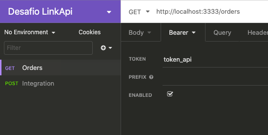

# desafio-linkapi

## :bookmark: Sobre
Uma API que busca os negócios marcados como 'Ganho' na plataforma Pipedrive, insere como pedido na plataforma Bling registra no banco de dados em MongoDB

## :rocket: Tecnologias Utilizadas
Durante o desenvolvimento foi utilizado as seguintes tecnologias
- Node.js
- Typescript
- MongoDB

## :question: Como usar
- #### Para conseguir rodar a aplicação é necessário alguns **pré-requisitos:**

  - É **necessário** possuir o **Node.js** instalado na máquina
  - Também, é **preciso** ter um gerenciador de pacotes seja o **NPM** ou **Yarn**.

1. Faça um clone :

```sh
  $ git clone https://github.com/Arthurferrera/desafio-linkapi.git
```

2. Para executar a aplicação siga os seguintes passos e execute comandos solicitados:

```sh
  # Renomeie o arquivo .env_example, para .env
  # Atribua valores para as variaveis que faltam (TODAS SÃO OBRIGATÓRIAS PARA O FUNCIONAMENTO DA API)
  
  # Instale as dependências
  $ npm install

  # Inicie a API
  $ npm run dev
```

3. Sincronize os dados do Pipedrive utilizando a seguinte rota
```sh
  # Método POST - É necessário enviar um token de autenticação para ser possível executar a integração (Disponível no arquivo .env/.env_example)
  $ http://localhost:3333/integration
```

4. Após sincronizar os dados do pipedrive é possível listar os pedidos enviados para o Bling
```sh
  # Método GET - É necessário enviar um token de autenticação para ser possível executar a integração (Disponível no arquivo .env/.env_example)
  $ http://localhost:3333/orders
```

Como adicionar o token de autenticação - Utilizei o aplicativo [Insomnia](https://insomnia.rest/download/)
  - Na aba de Authorization é necesário selecionar o tipo **Bearer Token** e no campo token colocar a string definida no arquivo .env
  
    
